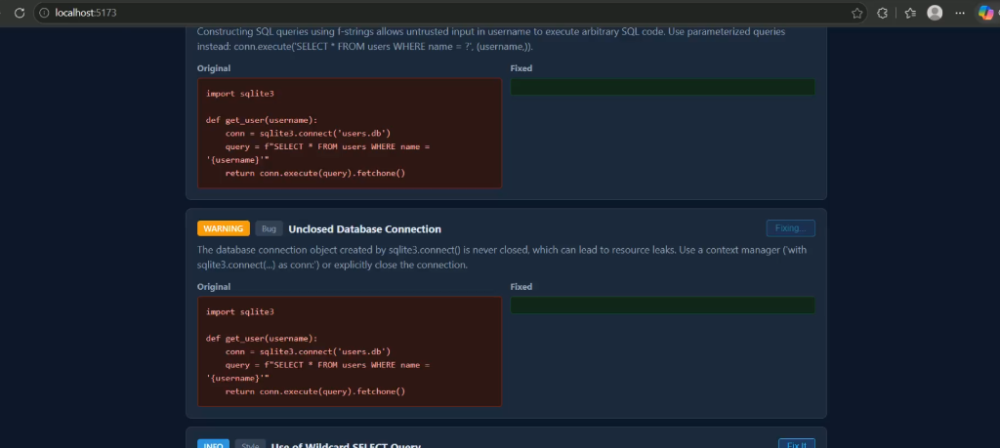
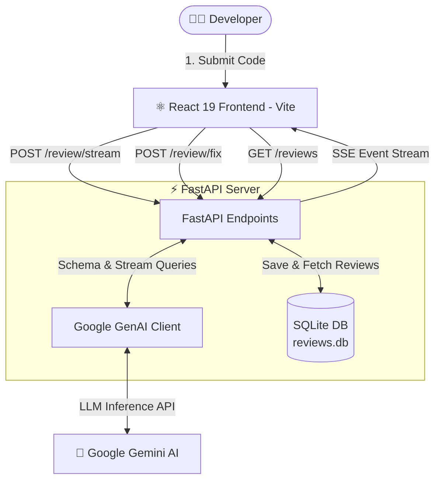

# 🔍 AI-Powered Code Reviewer

<div align="center">


### *Supercharge your development with real-time AI code reviews, vulnerability detection, and 1-click automated fixes powered by Google Gemini.*

[](https://github.com/vaishnaviwangalwar-cpu/Code_Reviewer_ai/stargazers)
[](https://fastapi.tiangolo.com)
[](https://react.dev/)
[](https://vitejs.dev/)
[](https://ai.google.dev/)
[](https://www.sqlite.org/)
[](https://opensource.org/licenses/MIT)

<p align="center">
  <a href="#-demo--visuals">Live Demo</a> •
  <a href="#-key-features">Key Features</a> •
  <a href="#-system-architecture">Architecture</a> •
  <a href="#-quick-start">Quick Start</a> •
  <a href="#-api-reference">API Reference</a> •
  <a href="#-project-structure">Project Structure</a>
</p>

</div>

---

## 🎬 Demo & Visuals

### 📸 Application Dashboard & Real-Time Code Analysis
Below is the CodeLens review dashboard showcasing real-time issue detection, severity badges, and side-by-side diff fixes:

<div align="center">
  
</div>

<br />

### 🎥 Video Demonstration

<!-- Note: To display a hosted video or GitHub asset, replace the source below with your uploaded video URL -->
https://github.com/user-attachments/assets/your-video-id-here

<details>
<summary>▶️ <b>Click to view local video embed instructions</b></summary>
<br>

If running locally or viewing in compatible markdown previewers:
```html
<video src="assets/demo-video.mp4" controls width="100%" poster="assets/demo-screenshot.png">
  Your browser does not support the video tag.
</video>
```
> **Tip:** When opening a Pull Request or creating a GitHub Release, you can drag and drop your `.mp4` video directly into GitHub's editor to generate a hosted video URL.

</details>

---

## ✨ Key Features

| Feature | Description |
| :--- | :--- |
| ⚡ **Real-Time Token Streaming** | Review suggestions stream instantly token-by-token via Server-Sent Events (SSE). |
| 🛡️ **Multi-Category Issue Triage** | Automatically identifies **Bugs**, **Security Vulnerabilities**, **Performance Bottlenecks**, and **Style Violations**. |
| 🚨 **Dynamic Severity Badging** | Color-coded severity indicators (<span style="color:#e74c3c">**CRITICAL**</span>, <span style="color:#f39c12">**WARNING**</span>, <span style="color:#3498db">**INFO**</span>) for fast prioritization. |
| 🛠️ **1-Click AI Fixes & Diff View** | Generates corrected code snippets with interactive, side-by-side **Original vs. Fixed** diff panels. |
| 📜 **Persistent Review History** | Built-in SQLite database stores every code review session with instant category filtering. |
| 🎨 **Dark Modern Interface** | Minimalist, responsive UI built with **React 19** and **Vite** for blazing fast performance. |

---

## 🏗️ System Architecture



---

## 🚀 Quick Start

Follow these simple steps to run CodeLens locally on your machine.

### 📋 Prerequisites
- **Python 3.10+** (Tested on Python 3.11 / 3.12 / 3.13)
- **Node.js 18+** & **npm**
- **Google Gemini API Key** ([Get your free API Key](https://aistudio.google.com/app/apikey))

---

### 1️⃣ Clone the Repository
```bash
git clone https://github.com/vaishnaviwangalwar-cpu/Code_Reviewer_ai.git
cd Code_Reviewer_ai
```

---

### 2️⃣ Backend Setup (FastAPI + Python)

1. **Create and activate a virtual environment:**
   ```bash
   # Windows (PowerShell)
   python -m venv venv
   .\venv\Scripts\Activate.ps1

   # macOS / Linux
   python3 -m venv venv
   source venv/bin/activate
   ```

2. **Install Python dependencies:**
   ```bash
   pip install fastapi uvicorn google-genai python-dotenv pydantic
   ```

3. **Configure Environment Variables:**
   Create a `.env` file in the project root:
   ```env
   GEMINI_API_KEY=your_google_gemini_api_key_here
   GEMINI_MODEL=gemini-3.5-flash
   ```

4. **Start the FastAPI Backend Server:**
   ```bash
   uvicorn backend.main:app --host 0.0.0.0 --port 8000 --reload
   ```
   > 🚀 Backend is now live at: `http://localhost:8000` (API documentation at `http://localhost:8000/docs`)

---

### 3️⃣ Frontend Setup (React 19 + Vite)

1. **Navigate to the frontend directory:**
   ```bash
   cd frontend
   ```

2. **Install dependencies:**
   ```bash
   npm install
   ```

3. **Start the Vite development server:**
   ```bash
   npm run dev
   ```
   > 🌐 Open your browser at: `http://localhost:5173/`

---

## 🔌 API Reference

| Method | Endpoint | Description | Payload Example |
| :--- | :--- | :--- | :--- |
| `GET` | `/` | API Health Check | *None* |
| `POST` | `/review` | Synchronous JSON review | `{"code": "def foo(): pass"}` |
| `POST` | `/review/stream` | Real-time SSE code review stream | `{"code": "def foo(): pass"}` |
| `POST` | `/review/fix` | Real-time SSE code fix stream | `{"code": "...", "issue_title": "...", "issue_description": "..."}` |
| `GET` | `/reviews` | Retrieve all historical reviews | *None* |

---

## 📁 Project Structure

```text
Code_Reviewer_ai/
├── backend/
│   ├── database.py         # SQLite connection & CRUD review queries
│   ├── gemini_client.py    # Google GenAI SDK client, prompts & schemas
│   ├── main.py             # FastAPI application & SSE streaming endpoints
│   └── reviews.db          # SQLite database storage
├── frontend/
│   ├── src/
│   │   ├── components/
│   │   │   ├── CodeInput.jsx       # Code submission form
│   │   │   ├── ReviewResults.jsx   # Real-time results, badges & diff views
│   │   │   └── ReviewHistory.jsx   # Historical review browser & filter
│   │   ├── App.jsx                 # Main application state & tabs
│   │   ├── App.css                 # Dark-mode styling & diff layout
│   │   └── main.jsx                # React root entry point
│   ├── package.json
│   └── vite.config.js
├── assets/
│   ├── hero.png            # Project banner logo
│   └── demo-screenshot.png # UI dashboard screenshot
├── .env.example            # Environment configuration template
├── README.md               # Interactive documentation
└── main.py                 # Root execution entrypoint
```

---

## 🧩 Usage Guide

1. **Start a Review:** Paste any snippet of code (Python, JavaScript, TypeScript, Go, etc.) into the editor and hit **"Review Code"**.
2. **Examine Issues:** Analyze the generated cards with actionable titles, issue explanations, and severity tags.
3. **Generate Fixes:** Click the **"Fix It"** button on any card to stream an intelligent correction side-by-side with your original code.
4. **Browse History:** Switch to the **"History"** tab anytime to look up previously analyzed code snippets and filter by issue type.

---

## 🤝 Contributing

Contributions, issues, and feature requests are welcome!

1. Fork the Project
2. Create your Feature Branch (`git checkout -b feature/AmazingFeature`)
3. Commit your Changes (`git commit -m 'Add some AmazingFeature'`)
4. Push to the Branch (`git push origin feature/AmazingFeature`)
5. Open a Pull Request

---

## 📄 License

Distributed under the **MIT License**. See [`LICENSE`](LICENSE) for more information.

---

<div align="center">
  <sub>Built with ❤️ by <a href="https://github.com/vaishnaviwangalwar-cpu">Vaishnavi Wangalwar</a></sub>
</div>
